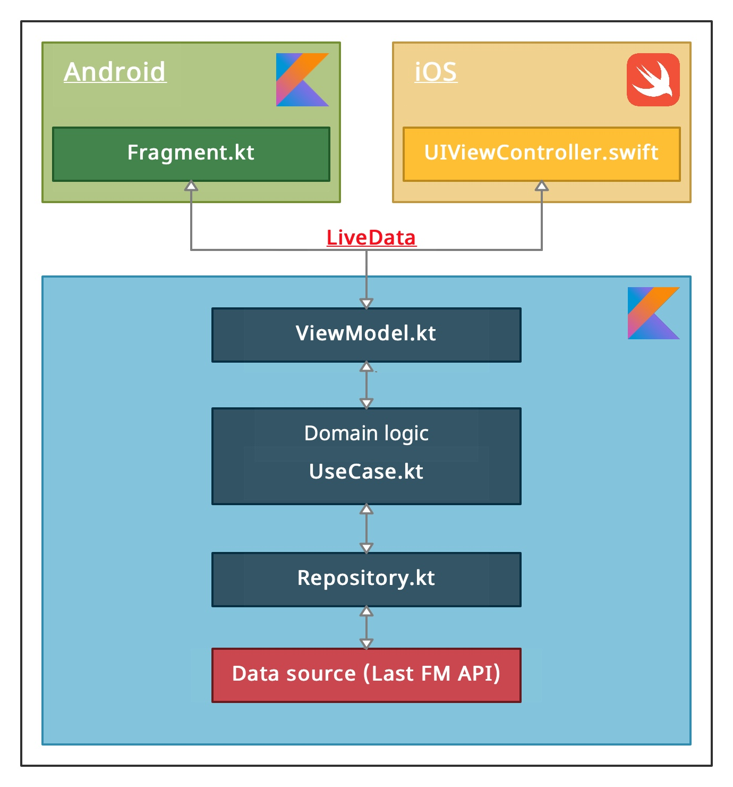
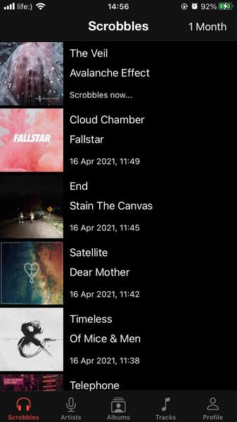
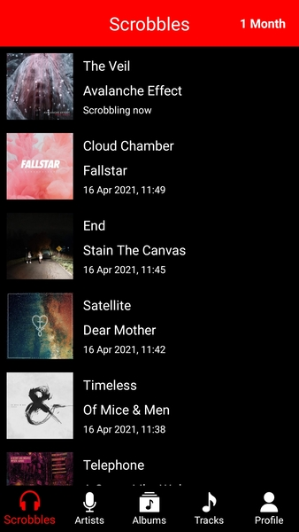
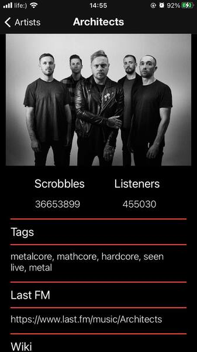
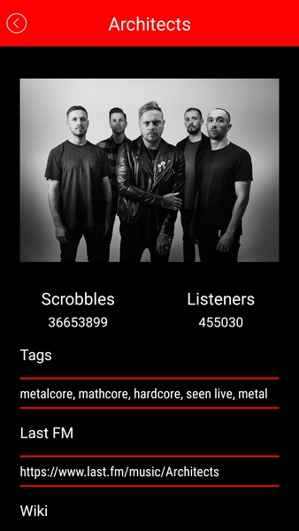
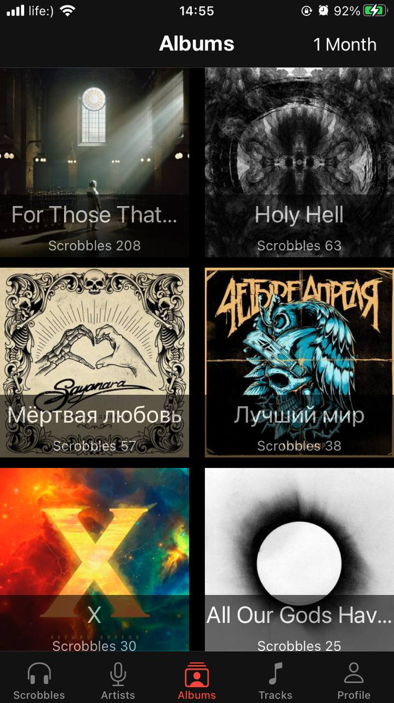
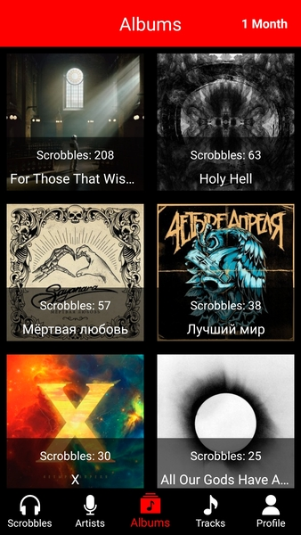

# Last FM

Kotlin multiplatform mobile project for Last.Fm portal.

General architecture scheme of KMM project:

To be able to assemble a project, you need to register as a developer on the Last.fm portal and get api keys.

Some screenshots:

 
 
 

Libraries used in the Project:

- [Ktor](https://github.com/ktorio/ktor)
- [Kotlinx.serialization (official)](https://github.com/Kotlin/kotlinx.serialization)
- [Kodein-DI](https://github.com/Kodein-Framework/Kodein-DI)
- [Reaktive](https://github.com/badoo/Reaktive)
- [Multiplatform-settings](https://github.com/russhwolf/multiplatform-settings)
- [Coroutine (official)](https://github.com/Kotlin/kotlinx.coroutines)
- [Multiplatform-LiveData](https://github.com/florent37/Multiplatform-LiveData)
